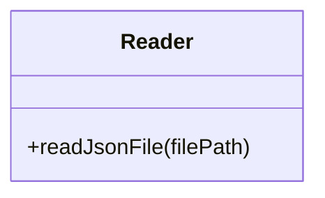
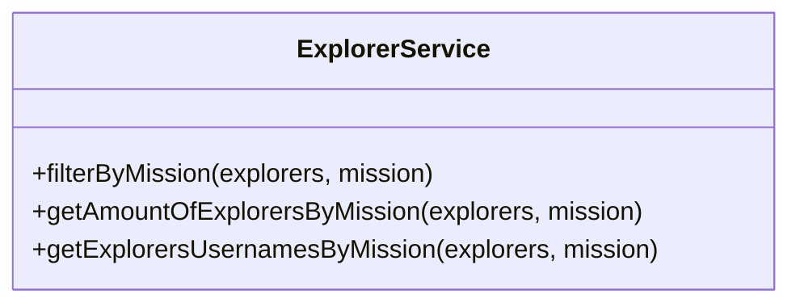
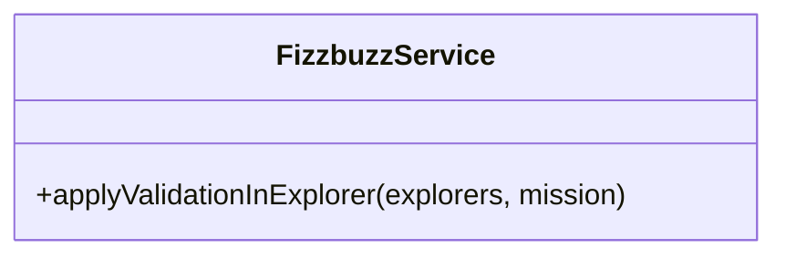

# Refactoring 🤪

## CASO

Como resultado de una consultoria externa se ha creado un script de mala calidad
y despues de una evaluacion interna realizada por el equipo de backend se tomó
la decisión de refactorizar el proyecto.

### Set de tareas a realizar

- Obtener una lista de explorers que están solo en node.
- Obtener la cantidad de explorers que están en java.
- Obtener la lista de usuarios de github de los explorers que estan en node.
- Se necesitó crear una validación llamada FizzBuzz, si el explorer tiene un score que sea divisible entre 3 (revisa cómo hacer esto), deberá tener un campo `trick` que diga `FIZZ`, cualquier otro caso el valor de este nuevo campo deberá ser el score mismo. Esta validación nos sirve porque necesitamos aplicarla a la lista de todos los explorers y saber cuáles son FIZZ.
- Después necesitamos una validación muy similar pero para cuando el score sea divisible entre 5, entonces el valor del nuevo campo `trick` será BUZZ, cualquier otro caso el valor será el score.
- Pero después volvimos a necesitar otro caso para cuando el valor del score fuera divisible entre 3 y también entre 5, entonces el valor del campo `trick` debe ser FIZZBUZZ, de lo contrario tendrá el valor del score.

### Requerimientos

1. Refactorizar el script legado y rehacerlo, con mucho cuidado ya que se trata de información sensible.
2. Crear un API para usar la funcionalidad anterior:

| Endpoint | Request | Response |
|---|---|---|
| `localhost:3000/v1/explorers/:mission` | `localhost:3000/v1/explorers/node` | Deberás obtener la lista de explorers en la misión que enviaste (node o java) |
| `localhost:3000/v1/explorers/amount/:mission` | `localhost:3000/v1/explorers/amount/node` | Deberás obtener la cantidad de explorers según la misión que enviaste (node o java) |
| `localhost:3000/v1/explorers/usernames/:mission` | `localhost:3000/v1/explorers/usernames/node` | Deberás obtener la lista de usernames en la misión que enviaste (node o java) |

3. Nuevo requerimiento: Crea un endpoint para recibir un número y aplicar la validación del fizzbuzz.

### ⚜ Procedimiento

#### Requerimiento 1

Para realizar esta práctica se tuvó que entender primero el código,
[Aquí](https://axlgoze.github.io/my_launchx_blog/posts/post_7/) puedes encontrar algunos conceptos que tuve que investigar durante la realizacion de este refactoring. 🦇

`código elaborado por consultoria externa:`

<details>
<summary> app.js & explorers.json </summary>

`app.js`
```javascript
const fs = require("fs");

// Part 1 Read json file ===========================
const rawdata = fs.readFileSync("explorers.json");
const explorers = JSON.parse(rawdata);

// Part 2: Get the quantity of explorers names in node
const explorersInNode = explorers.filter((explorer) => explorer.mission == "node");
//console.log(explorersInNode.length)

// Part4: Get the explorer's usernames in Node
const explorersInNodeToGetUsernames = explorers.filter((explorer) => explorer.mission == "node");
const usernamesInNode = explorersInNodeToGetUsernames.map((explorer) => explorer.githubUsername);
//console.log(usernamesInNode)

// DEAD CODE: Part 5,6,7, please remove this and go to Part 8!

// Part 5: Get a new list of explorers in node, if the score numbers is divisible by 3, I need a new propery called trick, and the value assigned is FIZZ, if not the value should be the score itself.
// Score: 3, Trick: FIZZ.
// Score: 4, Trick: 4.
// Score: 5, Trick: 5.

const assignFizzTrick = function(explorer){
    if(explorer.score%3 === 0){
        explorer.trick = "FIZZ";
        return explorer;
    }else{
        explorer.trick = explorer.score;
        return explorer;
    }
};

const explorersInNodeAndFizzTrick = explorersInNode.map((explorer) => assignFizzTrick(explorer));

// Part 6: Get a new list of explorers in node if the score number is divisible by 5, we need to set a new property called trick and set the value BUZZ, if not this value should be just the score
//
const assignBuzzTrick = function(explorer){
    if(explorer.score%5 === 0){
        explorer.trick = "BUZZ";
        return explorer;
    }else{
        explorer.trick = explorer.score;
        return explorer;
    }
};

const explorersInNodeAndBuzzTrick = explorersInNode.map((explorer) => assignBuzzTrick(explorer));

//Part7: Get a new list of explorers in Node, if the score number is divisible by 3 AND by 5 we need to set a new property called FIZZBUZZ, if not this value should be the same score value

const assignFizzBuzzTrick = function(explorer){
    if(explorer.score%5 === 0 && explorer.score%3 === 0){
        explorer.trick = "FIZZBUZZ";
        return explorer;
    }else{
        explorer.trick = explorer.score;
        return explorer;
    }
};

const explorersInNodeAndFizzBuzzTrick = explorersInNode.map((explorer) => assignFizzBuzzTrick(explorer));

// Part 8: Get a list of the explorers in node, if the score is divisible by 5 and 3, set the property trick and the value FIZZBUZZ, if is just divisible by 5 set the property trcik and the value BUZZ, if is just divisible by 3 set the property trick and the value FIZZ, otherwise set the property trick and the score value. TODO

```

  `explorers.json`
``` json
[
{
  "name": "Woopa1",
  "githubUsername": "ajolonauta1",
  "score": 1,
  "mission": "node",
  "stacks": [
    "javascript",
    "reasonML",
    "elm"
  ]
},
{
  "name": "Woopa2",
  "githubUsername": "ajolonauta2",
  "score": 2,
  "mission": "node",
  "stacks": [
    "javascript",
    "groovy",
    "elm"
  ]
},
{
  "name": "Woopa3",
  "githubUsername": "ajolonauta3",
  "score": 3,
  "mission": "node",
  "stacks": [
    "elixir",
    "groovy",
    "reasonML"
  ]
},
{
  "name": "Woopa4",
  "githubUsername": "ajolonauta4",
  "mission": "node",
  "score": 4,
  "stacks": [
    "javascript"
  ]
},
{
  "name": "Woopa5",
  "githubUsername": "ajolonauta5",
  "score": 5,
  "mission": "node",
  "stacks": [
    "javascript",
    "elixir",
    "elm"
  ]
},
{
  "name": "Woopa6",
  "githubUsername": "ajolonauta6",
  "score": 6,
  "mission": "java",
  "stacks": [
    "elm"
  ]
},
{
  "name": "Woopa7",
  "githubUsername": "ajolonauta7",
  "mission": "java",
  "score": 7,
  "stacks": [
  ]
},
{
  "name": "Woopa8",
  "githubUsername": "ajolonauta8",
  "score": 8,
  "mission": "java",
  "stacks": [
    "elm"
  ]
},
{
  "name": "Woopa9",
  "githubUsername": "ajolonauta9",
  "score": 9,
  "mission": "java",
  "stacks": [
    "javascript",
    "elixir",
    "groovy",
    "reasonML",
    "elm"
  ]
},
{
  "name": "Woopa10",
  "githubUsername": "ajolonauta10",
  "score": 10,
  "mission": "java",
  "stacks": [
    "javascript",
    "elixir",
    "groovy",
    "reasonML",
    "elm"
  ]
},
{
  "name": "Woopa11",
  "githubUsername": "ajolonauta11",
  "score": 11,
  "mission": "node",
  "stacks": [
    "javascript",
    "elixir",
    "groovy",
    "reasonML",
    "elm"
  ]
},
{
  "name": "Woopa12",
  "githubUsername": "ajolonauta12",
  "score": 12,
  "mission": "node",
  "stacks": [
    "javascript",
    "elixir",
    "groovy",
    "reasonML",
    "elm"
  ]
},
{
  "name": "Woopa13",
  "githubUsername": "ajolonauta13",
  "score": 13,
  "mission": "node",
  "stacks": [
    "javascript",
    "elixir",
    "groovy",
    "reasonML",
    "elm"
  ]
},
{
  "name": "Woopa14",
  "githubUsername": "ajolonauta14",
  "score": 14,
  "mission": "node",
  "stacks": [
    "javascript",
    "elixir",
    "groovy",
    "reasonML",
    "elm"
  ]
},
{
  "name": "Woopa15",
  "githubUsername": "ajolonauta15",
  "score": 15,
  "mission": "node",
  "stacks": [
    "javascript",
    "elixir",
    "groovy",
    "reasonML",
    "elm"
  ]
}
] 
```  
  
</details>

# Parte 1 Refactoring

Para dar una mejor estructura se requiere de la modularización del proyecto creando lo siguiente:

Crearemos lo siguiente:
- `Reader`: en esta clase necesitaremos un método static para leer el archivo y obtener la información dado el nombre archivo.
- `ExplorerService`: aquí vamos poner tres métodos static para obtener lo que se necesita realizar con la lista de explorers. En este service vamos a realizar todas las operaciones de filtrado y mapeo que se necesiten.
- `FizzbuzzService`: aquí haremos un método static para aplicar la validación sobre un explorer y agregarle el campo que se necesita.







4. Separando responsabilidad de leer archivo JSON
```javascript
const fs = require("fs")
class Reader{
        static readJsonFile(path){ //debe recibir una path del archivo a leer
                //logica para leer archivo y retornar información
                const rawdata = fs.readFileSync(path); //read json file
                return JSON.parse(rawdata); //content into json
        }
}

module.exports = Reader

```

5. Explorer Service

